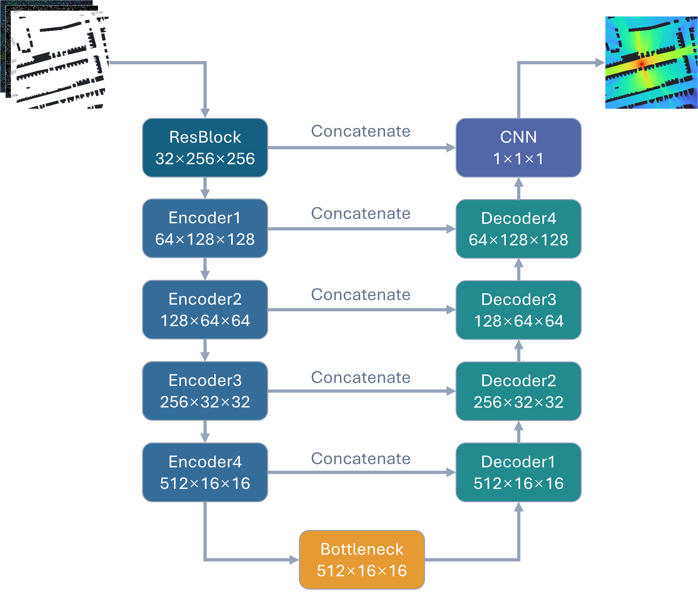
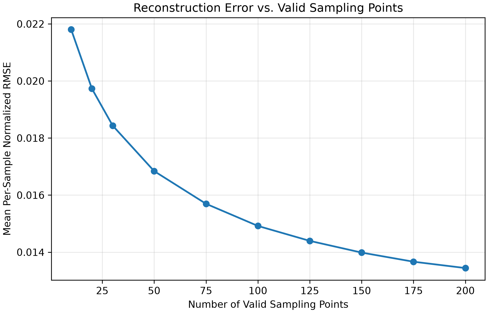
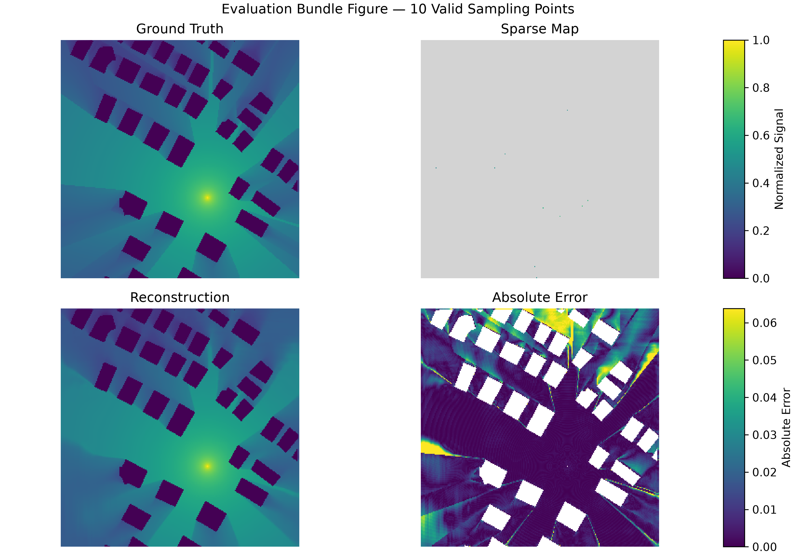
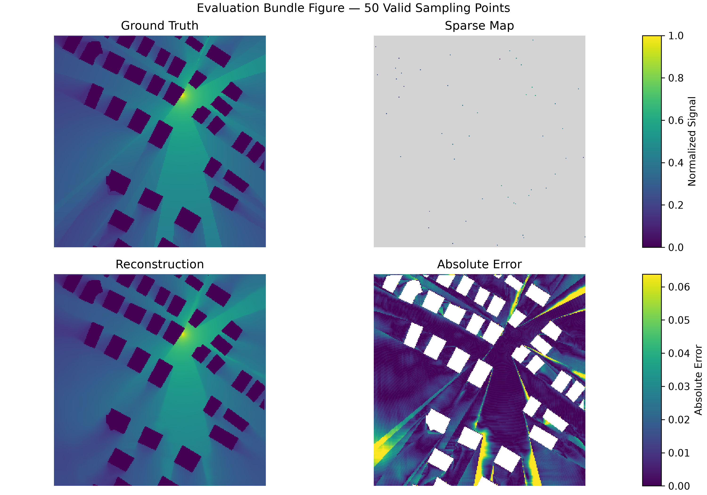
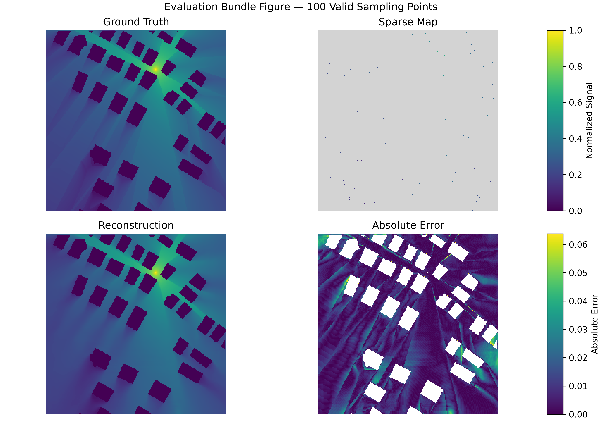
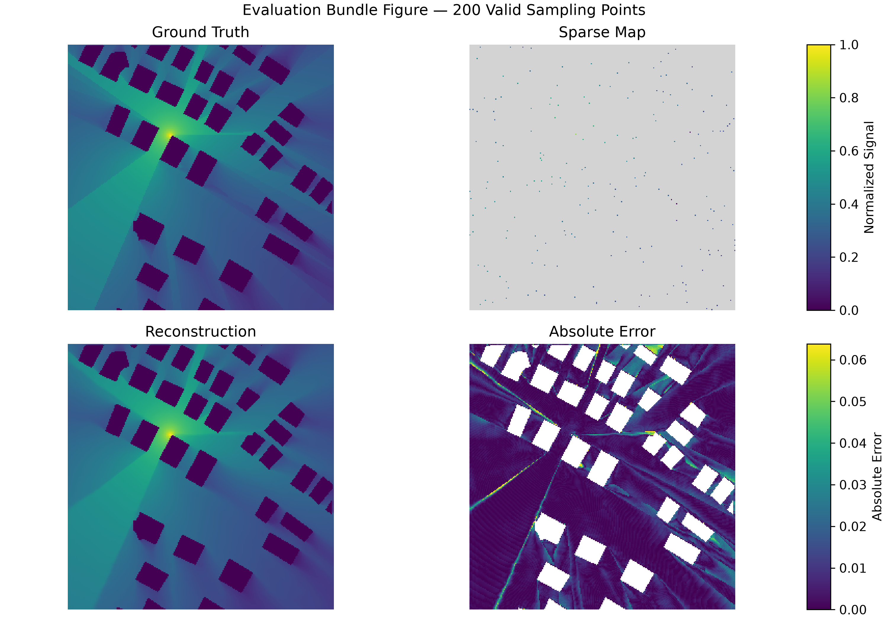
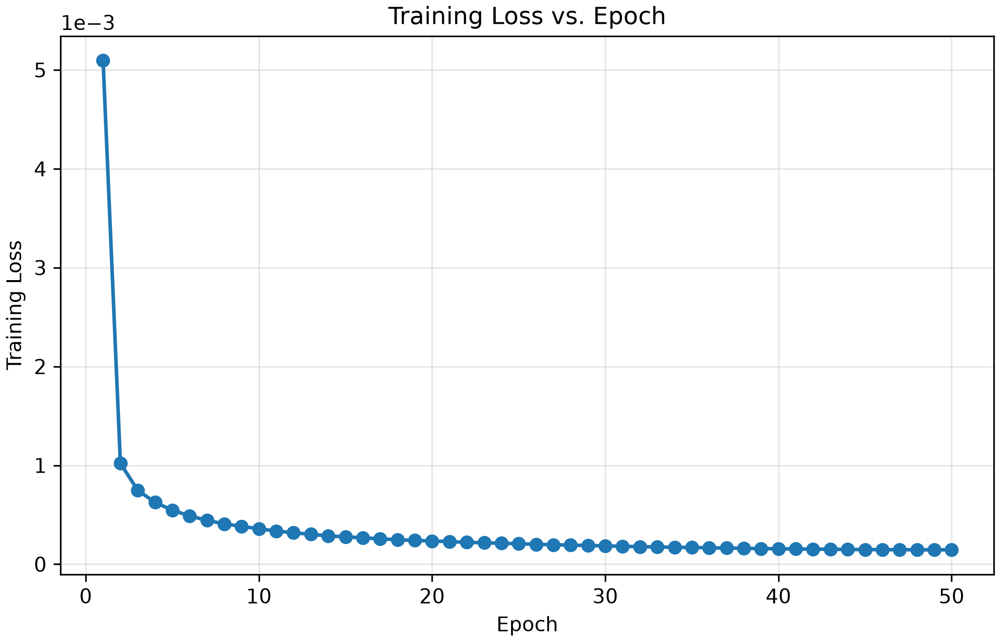
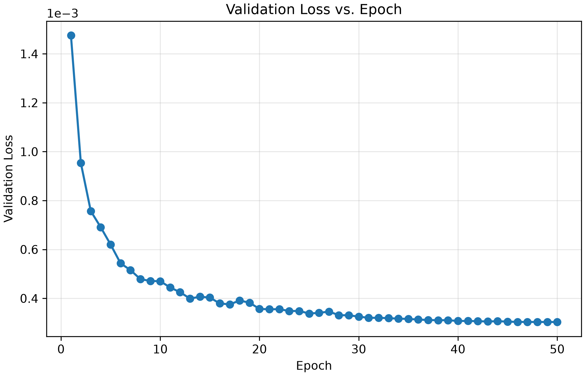
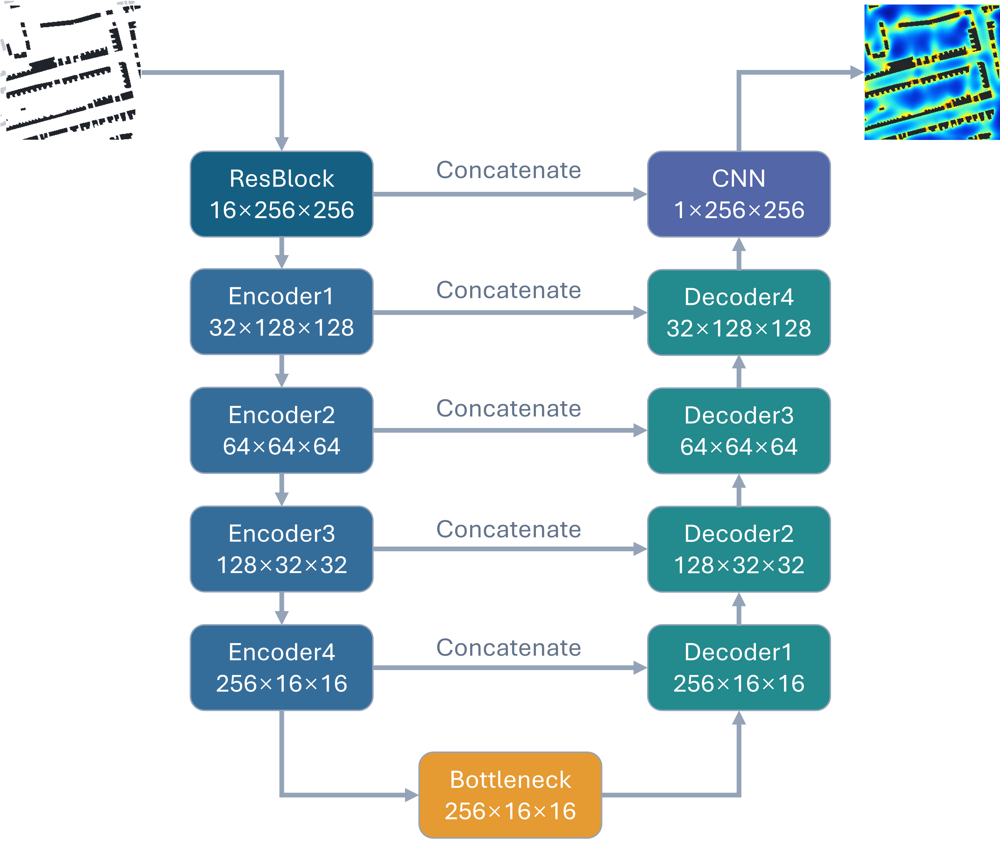
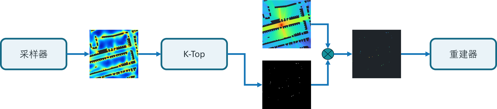

# 8月31号周报

## 1. 研究内容

本研究旨在设计高效的信道地图采样策略，充分利用传播环境和已有信息，降低采样开销，并提高信道地图重建精度

## 2. 已完成工作

### 2.1 本周核心结论

### 2.2 重建器

#### 2.2.1 重建器设计

**重建器输入**：

1. 建筑物分布图

2. 稀疏信道地图

3. 稀疏信道地图掩码

4. 发射机位置图

**重建器输出**：

1. 重建后的稠密信道地图

重建器由一个ResUNet网络组成，如下图所示。残差块和下采样池化层组成编码器，双线性上采样层和残差块组成了解码器。中间的瓶颈层由一个残差块组成。

该网络一共有5层特征层，分别对应了不同尺度的特征。特征层的通道数分别为32，64，128，256，512。相同特征层的编码器残差块输出会按通道拼接到到解码器残差块的输入，在恢复信道地图细节的同时保留多尺度语义信息。

#### 2.2.2 不同采样点数下的定量结果

下面的表格和折线图展示了采样点数和平均RMSE的关系。其中，平均RMSE是测试集上统计的结果。

从下面图表中可以看出，采样点数越多，平均RMSE越低。并且平均RMSE下降速度随着采样点数的增加而减小。

| 有效采样点数 | 10 | 20 | 30 | 50 | 75 | 100 | 125 | 150 | 175 | 200 |
| --- | --- | --- | --- | --- | --- | --- | --- | --- | --- | --- |
| RMSE | 0.02181 | 0.01973 | 0.01844 | 0.01684 | 0.01570 | 0.01492 | 0.01440 | 0.01398 | 0.01366 | 0.01344 |

#### 2.2.3 测试案例展示

下面四张图为信道地图真值，重建信道地图，稀疏信道地图，绝对误差图的联合图像。四张图像的有效采样点数分别为10，50，100，200。

#### 2.2.4 数据集

RadioMapSeer包含了701张城市地图。每张地图大小为256×256，设置有80个发射机的位置。该数据集使用Altair WinProp仿真生成数据。载波频率为5.9GHz，带宽为10MHz，发射功率为23dBm，发射机和接收机高度为1.5m，建筑物统一高度为25m，天线为各向同性天线。

该数据集提供了三种传播模型：

- DPM：只关注主要传播路径

- IRT2：考虑最多2次反射或绕射，比DPM结果精细

- IRT4：考虑最多4次反射或绕射

本实验目前主要使用了DPM进行训练。训练集、验证集和测试集的划分比例分别为80%、10%和10%。

#### 2.2.5 信道地图掩码生成

训练集中，每一个样本随机生成一个掩码。单次掩码生成中，掩码的采样点数服从分布$\mathcal{U}\{10,11,\ldots,200\}$。每一轮epoch都会给每个样本重新生成一个掩码。

验证集和测试集中，第一轮epoch生成固定掩码，后续epoch中的掩码不变。

#### 2.2.6 可复现性

数据集的划分，验证集和测试集生成的固定掩码都可以由固定的seed复现。在使用相同的模型权重文件和相同参数配置的情况下，程序可以复现出该模型在测试集上生成的数据文件、图像文件。

#### 2.2.7 训练

本实验采用了混合采样点数量的训练策略，旨在提高模型对不同采样点数量的稀疏采样图上的泛化能力。相应的，验证阶段同样涵盖多种采样点数量，使验证损失能够综合反映模型在不同采样条件下的整体性能。

**训练配置如下**：

- 优化器：Adam

- 初始学习率: 0.0003

- 学习率调度：余弦退火

- 学习率下降轮数：50

- 最终学习率：0.000001

- 损失函数：有效接受区域上的MSE

- 训练轮数：50

- batch size：32

下面两张图分别展现了训练loss和验证loss的变化，训练loss整体趋势持续向下。验证loss有少量波动，但整体趋势也是向下的，并且没有后期反弹，表明训练过程总体稳定，暂未观察到明显的后期过拟合现象。

    
## 3. 未来的工作

### 3.1 STE方法采样器

#### 3.1.1 采样器设计

**采样器输入**：

1. 建筑物分布图

2. 发射机位置图

**采样器输出**：

1. 采样点分数图

采样器的网络结构和重建器一致，都采用了ResUNet结构，但是参数量远小于重建器。采样器架构图如下：

#### 3.1.2 采样器与重建器级联

**前向传播**：

如上图所示，采样器输出采样分数图，选择出分数最高的K个点作为采样点。

$$
\Omega_K
=
\operatorname{TopKIndices}
\left(
\left\{S_{i,j}\mid(i,j)\in\mathcal V\right\},
K
\right),
\qquad
\Omega_K\subseteq\mathcal V
$$

其中， $S_{i,j}$ 表示位置 $(i,j)$ 的采样分数， $\mathcal V$ 表示有效点位置的集合。

根据选择出的K个采样点生成采样掩码和稀疏采样图，用于传入后续重建器重建信道地图。

$$
M_{i,j}
=
\begin{cases}
1, & (i,j)\in\Omega_K,\\
0, & (i,j)\notin\Omega_K,
\end{cases}
\qquad
\sum_{i=1}^{H}\sum_{j=1}^{W}M_{i,j}=K
$$

$$
\mathbf{H}_{\mathrm{s}}
=
\mathbf{H}\odot\mathbf{M}
$$

其中， $M_{i,j}$ 表示位置 $(i,j)$ 的掩码， $\mathbf{H}_{\mathrm{s}}$ 表示稀疏信道地图， $\mathbf{H}$ 表示真实信道地图。

**反向传播**：

如上图所示，先通过反向传播计算出采样掩码的梯度 $\frac{\partial L}{\partial M}$ 。再由连续的soft Top-K函数代替不可微的Top-K操作进行反向传播，计算出采样分数图的梯度 $\frac{\partial L}{\partial S}$ 。最后，计算出采样器所有参数的梯度，完成反向传播。

soft Top-K函数如下所示：

$$
\widetilde{M}_{i,j}
=
\begin{cases}
\dfrac{1}{
1+\exp\left(
-\dfrac{s_{i,j}-\lambda}{\tau}
\right)
},
& (i,j)\in\mathcal{V}, \\[8pt]
0,
& (i,j)\notin\mathcal{V},
\end{cases}
\qquad
\sum_{(i,j)\in\mathcal{V}}
\widetilde{M}_{i,j}
\approx K
$$

其中， $\widetilde{M}_{i,j}$ 代表位置 $(i,j)$ 的软掩码值， $s_{i,j}$ 代表位置 $(i,j)$ 的采样分数， $\lambda$ 为自适应阈值，基于当前采样分数通过二分法动态求解， $\tau$ 为温度参数。

### 3.2 梯度引导概率采样器

#### 3.2.1 采样器原理

从重建器的测试结果可以看出，重建信道地图在增益梯度较大区域误差较为显著。同时，远离发射机区域误差也明显高于近距离区域。因此，在增益变化剧烈和距离发射机较远区域适当增加采样点数量可以提高重建信道地图精度。

#### 3.2.1.1 增益梯度图

首先，设计一个和重建器架构一致的粗糙重建器，但是粗糙重建器不会输入稀疏信道地图采样。

**粗糙重建器输入**：

1. 建筑物分布图

2. 发射机位置图

**粗糙重建器输出**：

1. 粗糙重建信道地图

通过Sobel算子，将粗糙重建信道地图转化为增益梯度图，公式如下：

<!-- $$
\nabla \mathbf{H}_c(x, y)=\sqrt{\frac{\partial H_c}{\partial x}^2+\frac{\partial H_c}{\partial y}^2}(改为sobel算子)
$$ -->

$$
S_x=
\begin{bmatrix}
-1 & 0 & 1 \\
-2 & 0 & 2 \\
-1 & 0 & 1 
\end{bmatrix},
\quad 
S_y=
\begin{bmatrix}
-1 & -2 & -1 \\
0 & 0 & 0 \\
1 & 2 & 1 
\end{bmatrix}
$$

$$
G_x=\mathbf{H_c} \ast S_x,
\quad
G_y=\mathbf{H_c} \ast S_y
$$

$$
G=\sqrt{G_x^2+G_y^2}
$$

其中，$S_x$ 代表水平方向卷积核，$S_y$ 代表垂直方向卷积核，$G_x$ 代表水平方向梯度，$G_y$ 代表垂直方向梯度，$\mathbf{H}_c$ 表示粗糙重建信道地图，$G$ 代表梯度幅值。

<!-- 再通过Softmax函数将增益梯度图变为采样概率图。候选点的梯度值越大，被采样的概率就越高。最后根据采样概率图进行K次不放回采样，生成一张带有K个采样点的掩码图。 -->

#### 3.2.1.2 发射机距离图

通过以下公式计算出有效候选点到发射机的距离：

$$
D_{i,j}
=
\sqrt{
(i-i_{\mathrm{tx}})^2
+
(j-j_{\mathrm{tx}})^2
}
$$

其中，$(i,j)$ 代表候选点位置，$(i_{tx},j_{tx})$ 代表发射机位置，$D_{i,j}$ 代表发射机到位置 $(i,j)$ 的距离。

计算出每个有效点到发射机的距离，组成发射机距离图。

#### 3.2.1.3 采样点分数图

增益梯度的大小和与发射机的距离都会影响该点的重建精度。综合考虑二者，按照如下方法构造采样点分数，用于选取合适的采样点。

首先，将增益梯度图和发射机距离图分别归一化。

$$
\widetilde{G}_{i,j} = \frac{G_{i,j} - G_{min}}{G_{max} - G_{min} + \varepsilon},
\quad
\widetilde{D}_{i,j} = \frac{D_{i,j} - D_{min}}
{D_{max} - D_{min} + \varepsilon}
$$

其中，$\varepsilon$为数值稳定项。

再根据如下公式的造出采样点分数。

$$
V_{i,j}= \alpha \widetilde{G}_{i,j} + (1-\alpha) \widetilde{D}_{i,j}
$$

其中，$V_{i,j}$ 代表位置 $(i, j)$ 的采样分数，$\alpha$ 代表梯度图的权重。

#### 3.2.1.4 加权K-means聚类采样

如果使用Top-K筛选分数最高的K个点，容易出现采样点聚集。而通过加权K-means形成K个空间簇，再从K个空间簇中分别选取一个采样点，能够缓解采样点集中的问题。具体方法如下：

首先，通过以下公式的计算出聚类权重：

$$
w_{i,j} = V_{i,j}
$$

对所有有效候选点坐标进行加权K-means，得到K个空间簇。加权K-means的优化目标如下：

$$
\min_{\{\mathcal{C}_k,\boldsymbol{\mu}_k\}_{k=1}^{K}}
\sum_{k=1}^{K}
\sum_{(i,j)\in\mathcal{C}_k}
w_{i,j}
\left\|
\mathbf{x}_{i,j}-\boldsymbol{\mu}_k
\right\|_2^2
$$

其中，$\mathcal{C}_k$ 代表第K个空间簇，$\boldsymbol{\mu}_k$ 代表第K个空间簇的中心点。

完成聚类后，选择距离聚类中心最近的有效候选点作为采样点。

$$
(i_k^\ast,j_k^\ast)
=
\underset{(i,j)\in\mathcal{C}_k}{\arg\min}
\left\|
\mathbf{x}_{i,j}-\boldsymbol{\mu}_k
\right\|_2^2,
\qquad k=1,2,\ldots,K
$$

最终的采样点集合如下：

$$
\mathcal{S}
=
\left\{
(i_k^\ast,j_k^\ast)
\right\}_{k=1}^{K}
$$
