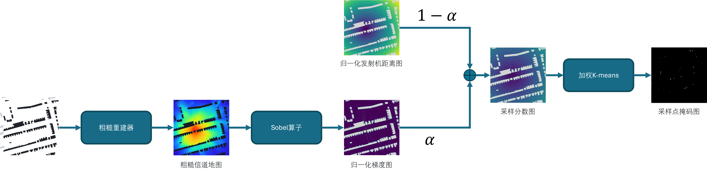
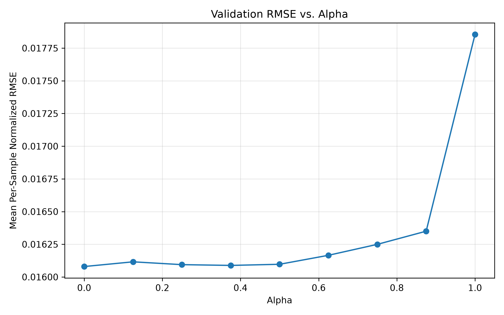
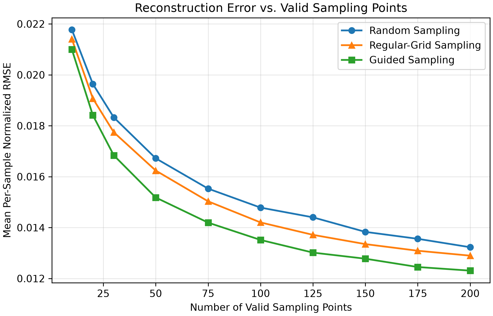
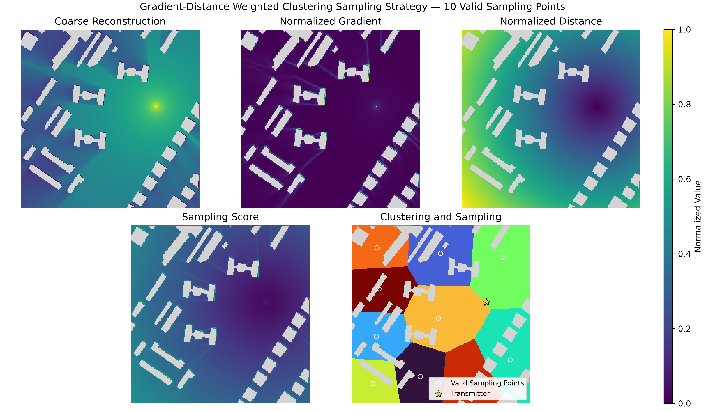
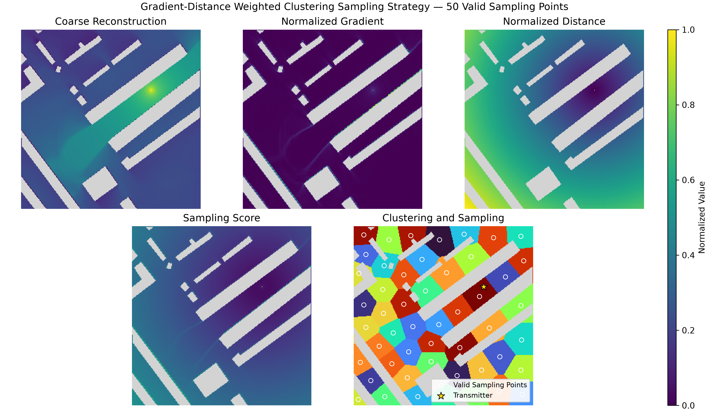
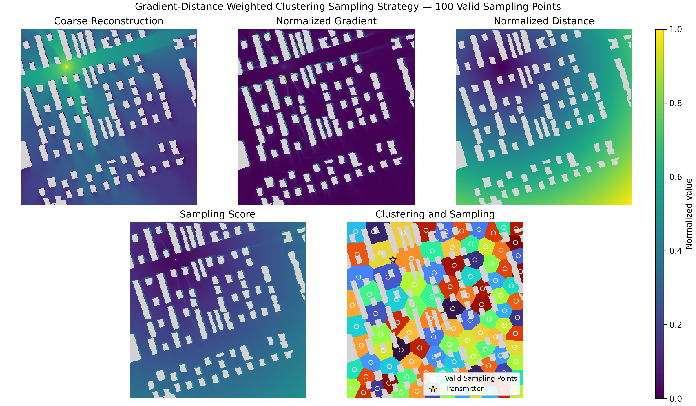
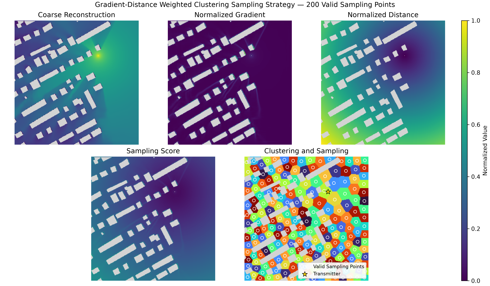

# 8月31日周报

## 1. 研究内容

本研究旨在设计高效的信道地图采样策略，充分利用传播环境与已有信息，在降低采样开销的同时，提高信道地图的重建精度。

## 2. 已完成工作

### 2.1 本周核心结论

本周完成了一个重建器和两种采样器的实现，主要结论如下：

- 重建器训练过程基本稳定，评测结果符合预期。
- STE-TopK 采样器训练未能收敛，当前方案暂不可用。
- 梯度-距离加权聚类采样器训练能够收敛，评测结果符合预期。

### 2.2 重建器

#### 2.2.1 重建器设计

**输入：**

1. 建筑物分布图
2. 稀疏信道地图
3. 稀疏信道地图掩码
4. 发射机位置图

**输出：**

1. 重建后的稠密信道地图

重建器采用 ResUNet 网络，其结构如下图所示。编码器由残差块和下采样池化层组成，解码器由双线性上采样层和残差块组成，中间的瓶颈层由一个残差块构成。

网络共包含 5 层不同尺度的特征层，通道数依次为 32、64、128、256 和 512。同尺度编码器残差块的输出会沿通道维度拼接至对应解码器残差块的输入，从而在恢复信道地图细节的同时保留多尺度语义信息。

#### 2.2.2 数据集

RadioMapSeer 数据集包含 701 张城市地图，每张地图的尺寸为 256×256，并设置了 80 个发射机位置。该数据集由 Altair WinProp 仿真生成，仿真参数如下：载波频率为 5.9 GHz，带宽为 10 MHz，发射功率为 23 dBm，发射机和接收机高度均为 1.5 m，建筑物高度统一为 25 m，天线采用各向同性天线。

该数据集提供以下三种传播模型：

- DPM：仅关注主要传播路径。
- IRT2：最多考虑 2 次反射或绕射，结果比 DPM 更精细。
- IRT4：最多考虑 4 次反射或绕射。

本实验目前主要采用 DPM 数据进行训练，训练集、验证集和测试集的划分比例分别为 80%、10% 和 10%。

#### 2.2.3 信道地图掩码生成

对于训练集，每个样本均随机生成一个掩码。在单次掩码生成过程中，采样点数服从分布 $\mathcal{U}\{10,11,\ldots,200\}$；每轮 epoch 开始时，都会为每个样本重新生成掩码。

对于验证集和测试集，掩码在第一个 epoch 生成后保持固定，后续 epoch 不再更新。

#### 2.2.4 训练设置

本实验采用混合采样点数的训练策略，以提高模型对不同采样点数稀疏信道地图的泛化能力。相应地，验证阶段也涵盖多种采样点数，使验证损失能够综合反映模型在不同采样条件下的整体性能。

训练配置如下：

- 优化器：Adam
- 初始学习率：0.0003
- 学习率调度策略：余弦退火
- 学习率下降轮数：50
- 最终学习率：0.000001
- 损失函数：有效接收区域上的 MSE
- 训练轮数：50
- Batch size：32

下图分别展示了训练损失和验证损失随 epoch 的变化。训练损失总体持续下降；验证损失虽有小幅波动，但整体同样呈下降趋势，且在训练后期未出现反弹。这表明训练过程总体稳定，目前未观察到明显的后期过拟合现象。

#### 2.2.5 可复现性

数据集划分以及验证集、测试集的固定掩码均可通过设定随机种子复现。在使用相同模型权重和参数配置的情况下，程序能够复现该模型在测试集上生成的数据文件与图像文件。

#### 2.2.6 不同采样点数下的定量结果

下表及折线图展示了采样点数与平均 RMSE 之间的关系，其中平均 RMSE 为测试集上的统计结果。

结果表明，随着采样点数增加，平均 RMSE 持续降低；同时，平均 RMSE 的下降幅度逐渐减小。

| 有效采样点数 | 10 | 20 | 30 | 50 | 75 | 100 | 125 | 150 | 175 | 200 |
| --- | --- | --- | --- | --- | --- | --- | --- | --- | --- | --- |
| RMSE | 0.02181 | 0.01973 | 0.01844 | 0.01684 | 0.01570 | 0.01492 | 0.01440 | 0.01398 | 0.01366 | 0.01344 |

#### 2.2.7 测试案例展示

下图依次展示了有效采样点数为 10、50、100 和 200 时的测试案例。每组图像均包含信道地图真值、重建信道地图、稀疏信道地图和绝对误差图。

### 2.3 重建驱动的环境感知 STE-TopK 采样器（训练未收敛）

#### 2.3.1 采样器设计

**输入：**

1. 建筑物分布图
2. 发射机位置图

**输出：**

1. 采样点分数图

采样器与重建器均采用 ResUNet 结构，但采样器的参数量远小于重建器。采样器的网络结构如下图所示。

#### 2.3.2 采样器与重建器级联

**前向传播：**

如上图所示，采样器首先输出采样分数图，再选择分数最高的 $K$ 个点作为采样点：

$$
\Omega_K
=
\operatorname{TopKIndices}
\left(
\left\{S_{i,j}\mid(i,j)\in\mathcal V\right\},
K
\right),
\qquad
\Omega_K\subseteq\mathcal V
$$

其中，$S_{i,j}$ 表示位置 $(i,j)$ 的采样分数，$\mathcal V$ 表示有效位置集合。

根据选出的 $K$ 个采样点生成采样掩码和稀疏信道地图，并将二者输入后续重建器以重建信道地图：

$$
M_{i,j}
=
\begin{cases}
1, & (i,j)\in\Omega_K,\\
0, & (i,j)\notin\Omega_K,
\end{cases}
\qquad
\sum_{i=1}^{H}\sum_{j=1}^{W}M_{i,j}=K
$$

$$
\mathbf{H}_{\mathrm{s}}
=
\mathbf{H}\odot\mathbf{M}
$$

其中，$M_{i,j}$ 表示位置 $(i,j)$ 的掩码值，$\mathbf{H}_{\mathrm{s}}$ 表示稀疏信道地图，$\mathbf{H}$ 表示真实信道地图。

**反向传播：**

如上图所示，首先通过反向传播计算采样掩码的梯度 $\frac{\partial L}{\partial M}$；随后以连续的 soft Top-K 函数替代不可微的 Top-K 操作进行反向传播，计算采样分数图的梯度 $\frac{\partial L}{\partial S}$；最后计算采样器全部参数的梯度，完成反向传播。

soft Top-K 函数定义如下：

$$
\widetilde{M}_{i,j}
=
\begin{cases}
\dfrac{1}{
1+\exp\left(
-\dfrac{s_{i,j}-\lambda}{\tau}
\right)
},
& (i,j)\in\mathcal{V}, \\[8pt]
0,
& (i,j)\notin\mathcal{V},
\end{cases}
\qquad
\sum_{(i,j)\in\mathcal{V}}
\widetilde{M}_{i,j}
\approx K
$$

其中，$\widetilde{M}_{i,j}$ 表示位置 $(i,j)$ 的软掩码值，$s_{i,j}$ 表示位置 $(i,j)$ 的采样分数，$\lambda$ 为根据当前采样分数通过二分法动态求解的自适应阈值，$\tau$ 为温度参数。

### 2.4 梯度-距离加权聚类采样器

#### 2.4.1 采样器原理

重建器的测试结果显示，重建信道地图在增益梯度较大的区域误差较为显著；同时，远离发射机区域的误差也明显高于近距离区域。因此，在增益变化剧烈和距离发射机较远的区域适当增加采样点，有助于提高信道地图的重建精度。采样器整体架构如下图所示。

##### 2.4.1.1 增益梯度图

首先，设计一个与重建器架构一致的粗糙重建器，但该重建器不输入稀疏信道地图。

**输入：**

1. 建筑物分布图
2. 发射机位置图

**输出：**

1. 粗糙重建信道地图

随后，通过 Sobel 算子将粗糙重建信道地图转换为增益梯度图：

$$
S_x=
\begin{bmatrix}
-1 & 0 & 1 \\
-2 & 0 & 2 \\
-1 & 0 & 1
\end{bmatrix},
\quad
S_y=
\begin{bmatrix}
-1 & -2 & -1 \\
0 & 0 & 0 \\
1 & 2 & 1
\end{bmatrix}
$$

$$
G_x=\mathbf{H_c} \ast S_x,
\quad
G_y=\mathbf{H_c} \ast S_y
$$

$$
G=\sqrt{G_x^2+G_y^2}
$$

其中，$S_x$ 和 $S_y$ 分别表示水平与垂直方向的卷积核，$G_x$ 和 $G_y$ 分别表示水平与垂直方向的梯度，$\mathbf{H}_c$ 表示粗糙重建信道地图，$G$ 表示梯度幅值。

##### 2.4.1.2 发射机距离图

采用下式计算各有效候选点到发射机的距离：

$$
D_{i,j}
=
\sqrt{
(i-i_{\mathrm{tx}})^2
+
(j-j_{\mathrm{tx}})^2
}
$$

其中，$(i,j)$ 表示候选点位置，$(i_{\mathrm{tx}},j_{\mathrm{tx}})$ 表示发射机位置，$D_{i,j}$ 表示位置 $(i,j)$ 到发射机的距离。所有有效候选点的距离共同组成发射机距离图。

##### 2.4.1.3 采样点分数图

增益梯度和与发射机之间的距离都会影响该位置的重建精度。为综合考虑两项因素，首先分别对增益梯度图和发射机距离图进行归一化：

$$
\widetilde{G}_{i,j} = \frac{G_{i,j} - G_{\min}}{G_{\max} - G_{\min} + \varepsilon},
\quad
\widetilde{D}_{i,j} = \frac{D_{i,j} - D_{\min}}
{D_{\max} - D_{\min} + \varepsilon}
$$

其中，$\varepsilon$ 为数值稳定项。

随后，按照下式构造采样点分数：

$$
V_{i,j}= \alpha \widetilde{G}_{i,j} + (1-\alpha) \widetilde{D}_{i,j}
$$

其中，$V_{i,j}$ 表示位置 $(i,j)$ 的采样分数，$\alpha$ 表示梯度图的权重。

##### 2.4.1.4 加权 K-means 聚类采样

若直接使用 Top-K 选取分数最高的 $K$ 个点，采样点容易过度聚集。为此，采用加权 K-means 将有效候选点划分为 $K$ 个空间簇，并从每个空间簇中分别选取一个采样点，以缓解采样点过度集中的问题。

首先，按照下式计算聚类权重：

$$
w_{i,j} = V_{i,j} + \varepsilon
$$

随后，对所有有效候选点的坐标进行加权 K-means 聚类，得到 $K$ 个空间簇。加权 K-means 的优化目标如下：

$$
\min_{\{\mathcal{C}_k,\boldsymbol{\mu}_k\}_{k=1}^{K}}
\sum_{k=1}^{K}
\sum_{(i,j)\in\mathcal{C}_k}
w_{i,j}
\left\|
\mathbf{x}_{i,j}-\boldsymbol{\mu}_k
\right\|_2^2
$$

其中，$\mathcal{C}_k$ 表示第 $k$ 个空间簇，$\boldsymbol{\mu}_k$ 表示第 $k$ 个空间簇的中心。

完成聚类后，从每个空间簇中选择距离聚类中心最近的有效候选点作为采样点：

$$
(i_k^\ast,j_k^\ast)
=
\underset{(i,j)\in\mathcal{C}_k}{\arg\min}
\left\|
\mathbf{x}_{i,j}-\boldsymbol{\mu}_k
\right\|_2^2,
\qquad k=1,2,\ldots,K
$$

最终得到的采样点集合为：

$$
\mathcal{S}
=
\left\{
(i_k^\ast,j_k^\ast)
\right\}_{k=1}^{K}
$$

#### 2.4.2 粗糙重建器训练

粗糙重建器采用与重建器相同的训练配置，具体参数如下：

- 优化器：Adam
- 初始学习率：0.0003
- 学习率调度策略：余弦退火
- 学习率下降轮数：50
- 最终学习率：0.000001
- 损失函数：有效接收区域上的 MSE
- 训练轮数：50
- Batch size：32

#### 2.4.3 不同 $\alpha$ 下的平均 RMSE

归一化梯度图与归一化距离图加权相加后得到采样分数图，其中 $\alpha$ 为归一化梯度图的权重。下图展示了不同 $\alpha$ 对验证集平均 RMSE 的影响。

结果表明，当 $\alpha$ 处于 $[0,0.5]$ 区间时，验证集平均 RMSE 保持在较低水平，且无明显波动；当 $\alpha$ 超过 $0.5$ 后，平均 RMSE 开始快速上升，并在 $\alpha=1$ 时达到最大值。

#### 2.4.4 三种采样策略下的平均 RMSE

本实验对比了随机采样、均匀网格采样和梯度-距离加权聚类采样对信道地图重建精度的影响。其中，梯度-距离加权聚类采样的归一化梯度图权重设为 0.5。下图展示了三种采样策略下测试集平均 RMSE 与采样点数之间的关系。

结果表明，梯度-距离加权聚类采样取得了最低的平均 RMSE。与随机采样和均匀网格采样相比，其平均 RMSE 分别降低约 7.67% 和 4.64%。

#### 2.4.5 采样案例

下图分别展示了采样点数为 10、50、100 和 200 时的采样案例。每组图像均包含粗糙重建图、归一化梯度图、归一化距离图、采样分数图和聚类图。

由上述案例可以看出，采样点整体分布较为分散，且在采样分数较高的区域分布更为密集。

## 3. 未来的工作

### 3.1 修改加权K-means的权重项

在"平均RMSE-$\alpha$"关系图中，$\alpha$在$[0, 0.5]$范围内，平均RMSE较低且无明显变化，说明梯度图对平均RMSE的影响较小。原因可能是权重对K-means结果的影响不够明显，即权重过小。尝试将加权K-means的公式修改为以下形式：

$$
w_{i,j} = V_{i,j}^n + \varepsilon
$$

其中，$n$为权重大小调节参数。

### 3.2 修改粗糙重建器为梯度重建器

目前，采样器通过粗糙重建器恢复粗糙信道地图，再通过Sobel算子计算梯度图。其中，梯度计算操作可以融合到粗糙重建器中，减小采样器的计算量。